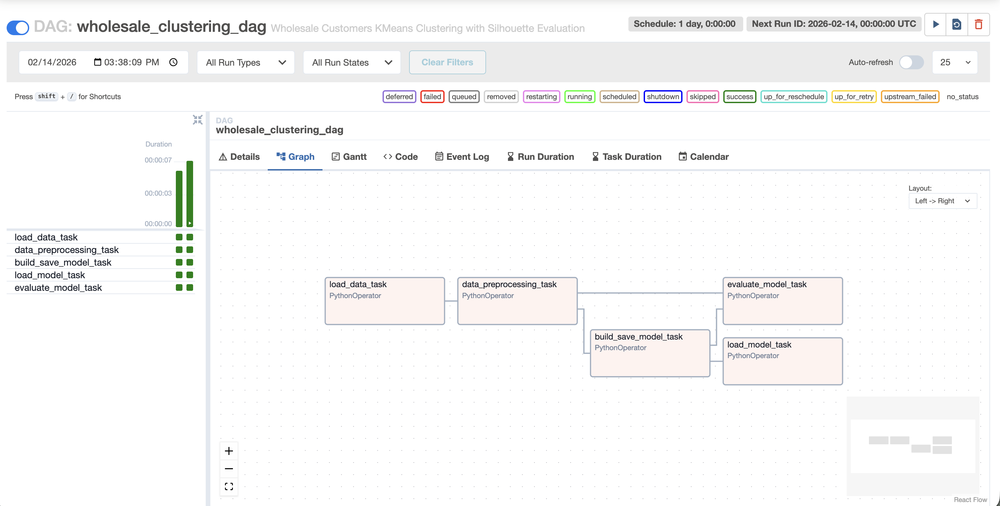
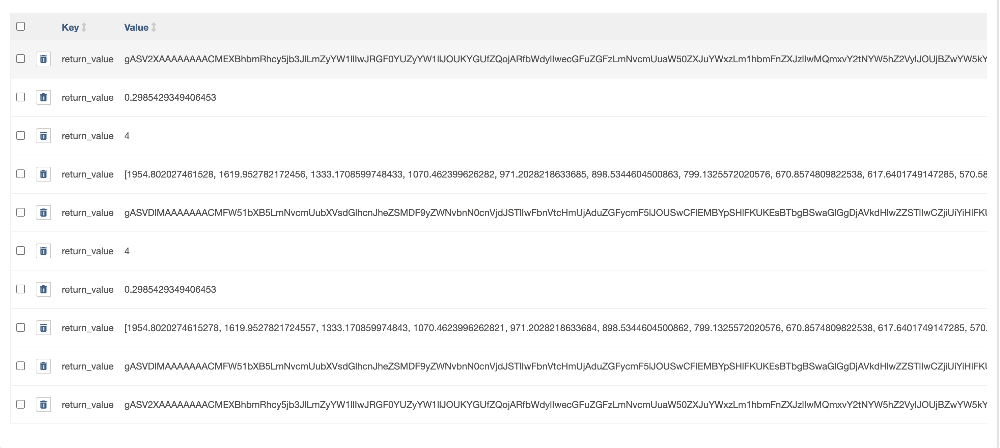

# Airflow Lab: Wholesale Customers KMeans Clustering

## Overview
An Apache Airflow DAG pipeline that performs KMeans clustering on the **Wholesale Customers** dataset (UCI ML Repository / Kaggle). The pipeline loads data, preprocesses it, builds a clustering model using the elbow method, predicts on test data, and evaluates clustering quality using Silhouette Score.

## Modifications from Original Lab
1. **Different Dataset** — Wholesale Customers (440 rows, 6 spending features: Fresh, Milk, Grocery, Frozen, Detergents_Paper, Delicassen) instead of Credit Card dataset
2. **StandardScaler** instead of MinMaxScaler for preprocessing, and saves the optimal-k model instead of k=49
3. **New Evaluation Task** — Added a 5th DAG task (`evaluate_model_task`) that computes Silhouette Score, creating a branching dependency graph instead of a linear pipeline

## DAG Structure
```
load_data_task → data_preprocessing_task → build_save_model_task → load_model_task
                                                                  → evaluate_model_task
```

## Pipeline Tasks
- **load_data_task**: Loads Wholesale Customers CSV and serializes via XCom
- **data_preprocessing_task**: Drops Channel/Region columns, applies StandardScaler
- **build_save_model_task**: Runs KMeans for k=2-20, finds optimal k via elbow method, saves best model
- **load_model_task**: Loads saved model, confirms elbow, predicts on test data
- **evaluate_model_task**: Computes Silhouette Score (achieved ~0.30)

## Results
- **Optimal Clusters (Elbow)**: k=5
- **Silhouette Score**: 0.2985
- **Test Prediction**: Cluster 4

## Setup & Run

### Prerequisites
- Docker Desktop installed and running
- At least 4GB memory allocated to Docker

### Steps

1. Create directories and env file
```bash
mkdir -p ./logs ./plugins ./working_data
echo "AIRFLOW_UID=$(id -u)" > .env
```

2. Download docker-compose and configure
```bash
curl -LfO 'https://airflow.apache.org/docs/apache-airflow/2.10.5/docker-compose.yaml'
```
Edit `docker-compose.yaml`:
- Set `AIRFLOW__CORE__LOAD_EXAMPLES: 'false'`
- Set `_PIP_ADDITIONAL_REQUIREMENTS: ${_PIP_ADDITIONAL_REQUIREMENTS:- pandas scikit-learn kneed}`

3. Initialize and run Airflow
```bash
docker compose up airflow-init
docker compose up -d
```

4. Open [http://localhost:8080](http://localhost:8080) (login: `airflow` / `airflow`)

5. Toggle ON `wholesale_clustering_dag` and click **Trigger DAG**

6. Stop when done
```bash
docker compose down
```

## Directory Structure
```
Airflow_Wholesale_Clustering/
├── dags/
│   ├── airflow.py              # DAG definition (5 tasks, branching)
│   ├── src/
│   │   └── lab.py              # Data processing, modeling, evaluation
│   └── data/
│       ├── file.csv            # Wholesale Customers dataset
│       └── test.csv            # Test sample for prediction
├── config/
│   └── airflow.cfg             # Airflow configuration
├── docker-compose.yaml         # Docker Compose setup
├── setup.sh                    # Environment setup script
├── .env                        # Airflow UID
└── README.md
```

## Tech Stack
- Apache Airflow 2.10.5
- Python 3.12, scikit-learn, pandas, kneed
- Docker Compose
- Dataset: [Wholesale Customers](https://www.kaggle.com/datasets/binovi/wholesale-customers-data-set)
## Screenshots

### DAG Graph View


### Task Execution Results

