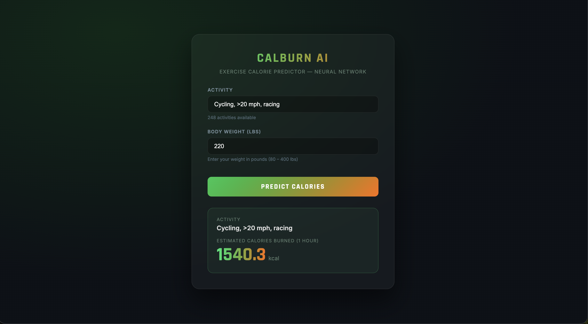

# Docker Lab: Exercise Calorie Predictor

## Overview
A Dockerised ML web app that predicts calories burned per hour for 248 physical activities based on body weight. Uses a multi-stage Docker build and Docker Compose with two services — one trains the model, the other serves it.

## Modifications from Original Lab 2
1. **Different Dataset** — Exercise/sport calorie table (248 activities) instead of Iris flowers
2. **Different Task** — Regression (predict calories) instead of Classification (predict species)
3. **Fixed scaler bug** — Original Lab 2 scales training data but never applies the scaler at inference; here both `scaler_X` and `scaler_y` are saved during training and loaded at serving time
4. **Port fix** — Original had `port=4000` in Python but `EXPOSE 80` in Dockerfile; this lab uses port 5001 consistently
5. **Config driven training** — hyperparameters and output artifact names are now controlled via JSON config files
6. **Automated tests + CI workflow** — this project now supports Labs 1-4 style delivery in one repo

## Labs 1-4 Coverage Map
1. **Lab 1 (Testing + Code quality)**
	- Added unit tests under `tests/`
	- CI runs `pytest`
2. **Lab 2 (Model training + versioned artifacts)**
	- `src/model_training.py` trains and exports model/scalers/activity metadata
	- `training_metrics.json` records MAE/RMSE/R2
3. **Lab 3 (Pipeline repeatability + config)**
	- `config/training_config.json` and `config/training_config_ci.json`
	- one-command reproducible training in local and CI environments
4. **Lab 4 (CI/CD + containerization)**
	- GitHub Actions workflow: `.github/workflows/labs1_to_4_ci.yml`
	- Docker image build validation in CI

## Dataset
**Source:** [Kaggle — Calories Burned During Exercise](https://www.kaggle.com/datasets/aadhavvignesh/calories-burned-during-exercise-and-activities)

| Column | Description |
|--------|-------------|
| Activity | Name of the exercise |
| 130 lb – 205 lb | Calories burned at each body weight |
| Calories per kg | Used as model feature |

Training data: 248 activities × 4 weight breakpoints = **992 samples**

## Model
- **Algorithm:** TensorFlow / Keras Sequential (Dense 64 → 64 → 32 → 1)
- **Features:** `calories_per_kg`, `weight_lbs`
- **Target:** Calories burned per hour
- **Test MAE:** ~1 calorie

## Directory Structure
```
Docker_Calorie_Predictor/
├── src/
│   ├── model_training.py
│   ├── main.py
│   ├── templates/
│   │   └── predict.html
│   └── data/
│       └── exercise_dataset.csv
├── dockerfile
├── docker-compose.yml
├── requirements.txt
└── README.md
```

## Setup & Run

### Prerequisites
- Docker Desktop installed and running

### Steps

1. Start both containers
```bash
docker compose up --build
```

2. Open [http://localhost:5001/predict](http://localhost:5001/predict)

3. Select an activity, enter your weight in lbs, click **Predict Calories**

4. Stop when done
```bash
docker compose down -v
```

## Run Training with Config

```bash
python src/model_training.py --config config/training_config.json
```

Generated artifacts:
- `exercise_model.keras`
- `scaler_X.pkl`
- `scaler_y.pkl`
- `activity_data.json`
- `training_metrics.json`

## Run Tests

```bash
pytest -q
```

## CI Workflow

Workflow file:

- `.github/workflows/labs1_to_4_ci.yml`

Pipeline stages:

1. install dependencies
2. run tests
3. train model with CI config
4. upload artifacts
5. build Docker image

## Tech Stack
- Python 3.10, TensorFlow 2.15, scikit-learn, Flask
- Docker (multi-stage build), Docker Compose
- Dataset: [Kaggle Exercise Dataset](https://www.kaggle.com/datasets/aadhavvignesh/calories-burned-during-exercise-and-activities)

## Screenshots


