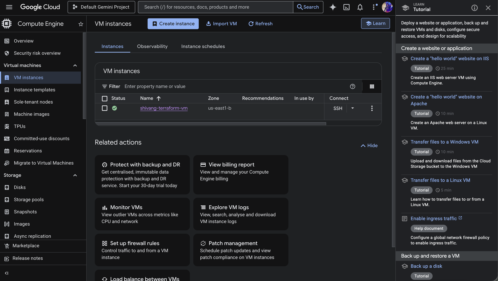
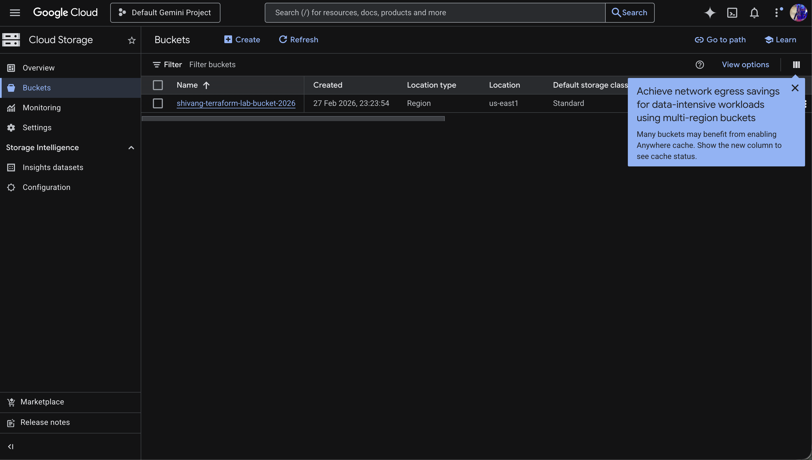

# Terraform GCP Infrastructure Lab

## Overview
This lab provisions GCP infrastructure using Terraform, including a Compute Engine VM instance and a Cloud Storage bucket. All resources are free tier eligible.

## What I Built
A Terraform configuration that:
* Creates an e2-micro VM instance running Ubuntu 22.04 LTS with nginx auto-installed
* Provisions a Cloud Storage bucket with versioning and lifecycle management
* Uses parameterized variables for easy customization
* Outputs key resource information like VM IPs and bucket URL

## Resources Created

| Resource | Details |
|----------|---------|
| Compute Engine VM | Ubuntu 22.04, e2-micro (free tier), nginx startup script, ephemeral public IP |
| Cloud Storage Bucket | Versioning enabled, 30 day lifecycle rule, uniform bucket level access |

## Project Structure

```
Lab1_Beginner/
├── main.tf                  # Provider config, VM instance, storage bucket
├── variables.tf             # Input variable definitions with defaults
├── outputs.tf               # Output definitions (VM IPs, bucket info)
├── terraform.tfvars.example # Example variable values
├── .gitignore
└── README.md
```

## Prerequisites
* GCP account with billing enabled
* Google Cloud CLI installed and authenticated
* Terraform >= 1.3.0 installed
* Service account key with Editor role

## Setup and Usage

1. Clone the repository

```
git clone https://github.com/shivang2402/MLOps.git
cd MLOps/Labs/Terraform_Labs/GCP/Lab1_Beginner
```

2. Set GCP credentials

```
export GOOGLE_APPLICATION_CREDENTIALS="/path/to/your-key-file.json"
```

3. Configure variables

```
cp terraform.tfvars.example terraform.tfvars
```

Edit `terraform.tfvars` with your GCP project ID and a unique bucket name.

4. Initialize Terraform

```
terraform init
```

5. Preview changes

```
terraform plan
```

6. Apply the configuration

```
terraform apply
```

Type `yes` to confirm. You should see:

```
Apply complete! Resources: 2 added, 0 changed, 0 destroyed.

Outputs:
bucket_name    = "shivang-terraform-lab-bucket-2026"
bucket_url     = "gs://shivang-terraform-lab-bucket-2026"
vm_external_ip = "34.138.206.98"
vm_internal_ip = "10.142.0.2"
vm_name        = "shivang-terraform-vm"
```

7. Verify in GCP Console

Check Compute Engine and Cloud Storage sections to confirm resources were created.

8. Destroy resources

```
terraform destroy
```

Type `yes` to confirm. Always destroy after verification to avoid charges.

## Screenshots

### VM Instance


### Cloud Storage Bucket


## Modifications from Original Lab
This lab includes the following modifications from the base Terraform GCP Lab:

1. **Multi-file Structure**: Split into `main.tf`, `variables.tf`, `outputs.tf`, and `terraform.tfvars` instead of a single `main.tf`
2. **Different Region**: Deployed to `us-east1` / `us-east1-b` instead of `us-central1` / `us-central1-a`
3. **Different OS**: Ubuntu 22.04 LTS instead of Debian 11
4. **Parameterized Config**: All values configurable through variables with sensible defaults
5. **Startup Script**: Automatically installs nginx on VM boot
6. **Enhanced Bucket**: Added versioning, 30 day lifecycle rule, and uniform bucket level access
7. **Outputs**: Added outputs for VM IPs, bucket name, and bucket URL
8. **Provider Pinning**: Pinned Google provider to `~> 5.0` with Terraform version constraint
9. **Additional Labels**: Added `managed_by = terraform` label to all resources